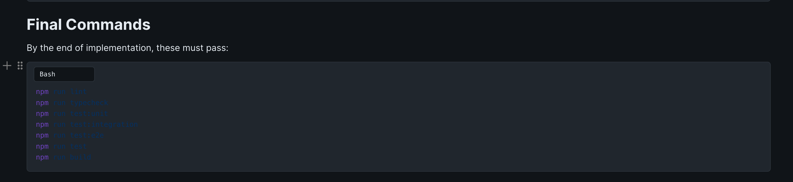
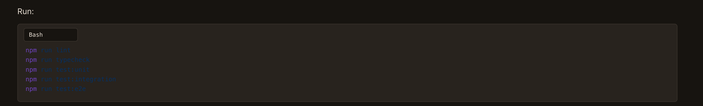
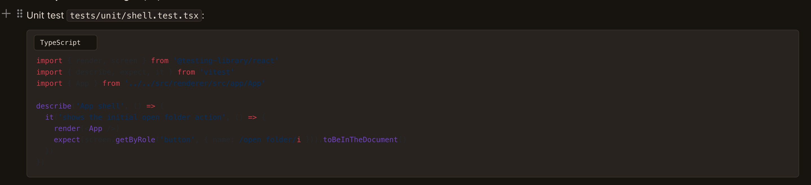

# 在Dark 模式, Code Block 看不清楚

## Status

* 2026-05-03: Auto-pick started. Reproduced the issue from the provided screenshots and traced it to editor code block syntax highlighting selecting the first loaded Shiki theme (`github-light`) even when the app is using a dark theme. Implementation will keep the existing code block UI and switch the editor highlighter theme from the current app theme family.
* 2026-05-04: Completed and released in `v1.4.15`. The editor code highlighter now chooses the Shiki theme from the current app theme family, cached highlighted tokens receive contrast-safe fallback colors, and the theme visibility E2E test asserts code token contrast across all built-in colorways. Verification passed with `npm run lint`, `npm run typecheck`, `npm run test:unit`, `npm run test:integration`, `npm run test:e2e`, `npm run docs:build`, and `npm run build`. GitHub Release workflow `25284518170` and Deploy User Manual workflow `25284518168` both completed successfully.

* 所有的dark theme, code block 对比度都不正常

