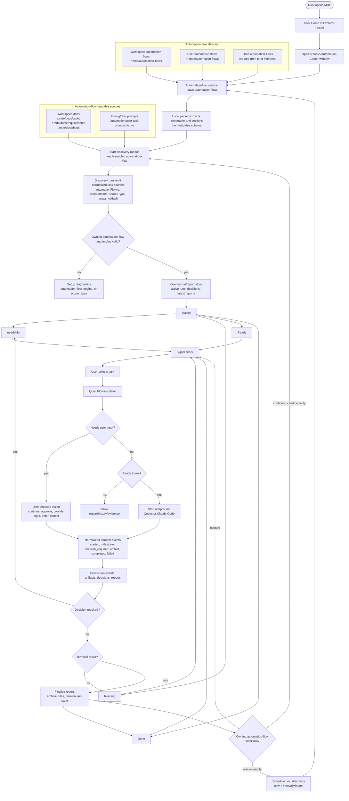

# Workspace Automation Console Design

Date: 2026-05-09
Status: Draft for user review

## Goal

Add an MDE Automation Center that helps users discover, run, monitor, and unblock workspace or user-level automation tasks without turning the Markdown editor into a general chat app or a noisy operations dashboard.

The first version is task-first. Workspace is optional context and filter metadata, not the main navigation model.

Reference prototype:

- `docs/superpowers/prototypes/workspace-automation-console.html`

## User Decisions

- Use the existing MDE app as the entry point.
- Add a normal Home icon button to the left side of `explorer.header`.
- Preserve the existing `explorer-sidebar-toggle` on the right side of `explorer.header`.
- Home opens or focuses the Automation Center. It must not replace the sidebar toggle.
- Automation Center opens as a separate MDE window, not as a popup over the editor.
- The Console adopts the combined `Signal Stack + Flowline` design.
- `Signal Stack` is the main task queue surface.
- `Quiet Flowline` is the detail surface for the selected task in every task state. `Running` and `Done` use milestone and report views; `Needs me` uses active run decisions; `Ready` uses start-preview views.
- Workspace filtering is a workspace item tree. Each workspace item can expand to show its automation-flow submenu.
- Users may include or exclude whole workspaces, individual workspace-local automation-flows, and no-workspace user-global automation-flows.
- The first Automation Center open selects the current workspace automation-flows and no-workspace user-global automation-flows by default. Later opens restore the user's last workspace and automation-flow filter.
- Task actions happen in Flowline for v1; task cards stay compact and do not expose inline quick actions.
- Support both Codex and Claude Code as execution adapters, but keep their sessions and histories separate.
- `automation-flow` is the automation entry point. MDE loads automation-flows first; each automation-flow discovers and emits its own tasks.
- Prefer formal automation-flows over draft automation-flows when multiple automation-flows pick the same source item.
- Draft automation-flows can start discovery only after they exist as saved, validated automation-flow definitions. A raw source item that was not returned by a discovery run is not a Signal Stack task.
- Automation-flow core logic should live in an independent workspace package, `packages/automation-flow`, so the same capability can later be reused outside the desktop app.
- V1 must include built-in automation-flow templates and a `New automation-flow` entry for creating user-global or workspace-local automation-flows.
- Formal automation-flow files are canonical Markdown documents with machine-readable YAML frontmatter and required prose sections. `@mde/automation-flow` parses and validates those files locally. Codex or Claude Code may help generate, infer, or repair draft automation-flow content, but normal loading must not depend on an external agent CLI being installed or authenticated.

## 2026-05-10 Acceptance Correction: Agent-Run Discovery

Automation Center must not turn static local scanning into READY tasks by itself. The
canonical task source is the result of executing an automation-flow discovery
phase through an Agent CLI session.

Rules:

- MDE may parse automation-flow Markdown locally only as a structural gate:
  frontmatter, required sections, schema shape, lifecycle, adapter selection,
  and safety policy.
- MDE must execute a discovery run for an enabled automation-flow before that
  automation-flow can emit READY tasks.
- READY tasks come from normalized discovery results returned by the Agent CLI
  session. They may reference local files, remote issues, remote merge requests,
  remote docs, prompt-like remote work items, or adapter-discovered sources.
- Local scanners such as `.mde/docs/{bugs,requirements,tasks}` discovery are
  helper tools that the discovery run may use. They are not the default READY
  source for Automation Center.
- A task execution run must receive the discovered source snapshot as data in
  its prompt bundle. Passing only `taskId` or `title` is insufficient.
- Discovery runs and task runs are separate runtime concepts. A discovery run
  produces source candidates; a task run executes exactly one discovered task.
- Each task run owns exactly one primary native Codex or Claude Code session.
  If resume fails, a continuation session may be created under the same MDE
  `runId`, with session lineage recorded.
- Run state is driven by normalized structured events and final reports from
  the adapter bridge, not by guessed final text or local fake state.
- Continuous automation means: after a terminal task report, the scheduler
  starts the next discovery run for that automation-flow, then selects the next
  READY discovered source.

## Product Positioning

MDE should be the control and review surface for automation. It does not replace Codex or Claude Code context management, tool execution, memory, or session semantics.

MDE owns:

- automation-flow-driven task discovery
- automation-flow ownership and validation
- built-in automation-flow template registry and template instantiation
- automation scheduler and adapter process orchestration
- run records
- human decision messages
- system notifications
- task reports
- UI for review and continuation

Execution adapters own:

- agent session history
- prompt and context compression
- filesystem/tool operations within their own permission model
- subagent execution
- adapter-specific logs

## Scope

The first implementation should support:

- Home button entry in the Explorer header.
- Opening/focusing one Automation Center window from Home.
- A task-first Signal Stack view with task status buckets:
  - `Needs me`
  - `Running`
  - `Ready`
  - `Done`
- Workspace item filtering with automation-flow secondary menus:
  - remembered workspaces
  - current workspace
  - workspace-local automation-flows under each workspace item
  - no-workspace user-global automation-flows
- Task cards with concise state, source, workspace context, automation-flow state, engine, and next action.
- Flowline detail for the selected task in `Needs me`, `Ready`, `Running`, and `Done`.
- Inbox-style decisions rendered as task states rather than a separate primary tab.
- Built-in automation-flow templates for common local task automation patterns.
- `New automation-flow` creation for user-global and workspace-local automation-flows.
- Explicit draft automation-flow records that are created from template or user-confirmed inference, then validated before they can start discovery runs.
- User-global and workspace-local automation-flow libraries.
- Run records with enough metadata to resume, audit, and report.
- System notification when a run enters a human-decision state.
- First-run setup for empty workspaces, missing adapters, and built-in automation-flow template creation.

The first implementation slice should ship one canonical intake channel:

- discovered task sources returned by automation-flow discovery sessions

The initial fake-agent acceptance path must demonstrate discovered local
Markdown tasks. Remote source kinds are part of the data model in v1 even when
their real provider adapters are added later.

Local helper capabilities available to discovery sessions:

- workspace Markdown task document scanner
- user-global task prompt scanner

Deferred task intake channels:

- current document or selection task creation
- manual task creation inside Automation Center

Non-goals for v1:

- Background daemon or launchd automation after MDE closes.
- Team-shared automation-flow synchronization.
- Full automation-flow marketplace.
- Merging Codex and Claude Code chat histories.
- Writing into external agent session files.
- Recreating terminal logs in the primary UI.
- Workspace-first dashboard navigation.
- Automatic release or destructive action without explicit automation-flow rules and human confirmation.

## V1 Implementation Slices

The implementation plan should keep v1 split into these slices instead of treating the Console as one large feature:

1. Entry and window shell: Explorer Home button, component ids, i18n keys, and separate Automation Center window lifecycle.
2. Automation-flow core package: add `packages/automation-flow` with schemas, type contracts, built-in template registry, structural validation, discovered-source normalization, diagnostics, and loop planning that do not depend on Electron, React, Codex, Claude Code, or desktop storage. It must not perform semantic task discovery.
3. Desktop automation runtime service: add main-process services for automation-flow loading, discovery-run execution, task-run execution, scheduler ticks, adapter processes, run/event/report stores, notifications, and IPC projections.
4. Automation-flow authoring and ownership: user-global automation-flows under `~/.mde/automation-flows`, workspace-local automation-flows under `<workspace-root>/.mde/automation-flows`, built-in `New automation-flow`, formal automation-flow validation, draft automation-flow records, task ownership conflict handling, and engine setup actions.
5. Signal Stack and Flowline UI: four task buckets, workspace item tree with automation-flow secondary menus, selected-task Flowline states, and report/evidence reveal.
6. Execution lifecycle: minimum Codex and Claude Code adapter contract, normalized events, run records, decision resume, reports, and system notifications.

## Entry Design

### Explorer Header

The Explorer header layout becomes:

```text
[Home icon button]  Explorer  [Sidebar toggle]
```

Rules:

- Home is a normal icon button for v1.
- The custom AI/smart Home icon is deferred to a separate design task.
- The sidebar toggle remains present and keeps its existing behavior.
- Home opens or focuses the Automation Center window.
- Home must have a stable component name and `data-component-id`.
- The toggle must keep its existing component id contract.

### Automation Center Window

Automation Center is a separate Electron window owned by MDE. Opening Home should:

- focus the existing Automation Center if one is already open
- create it if absent
- preserve the current editor window and document state
- avoid modal layering over the editor

### Desktop Runtime Ownership

Automation work is owned by main-process services in `apps/desktop`, not by the Automation Center renderer window.

Main-process services own:

- automation-flow file loading and validation
- discovery-run execution and discovered-source indexing
- helper-only task source scanning for discovery sessions
- ownership of discovered sources by the automation-flow that emitted them
- scheduler ticks and loop state
- adapter process startup, resume, cancellation, native-session open, and capability probes
- run, event, decision, evidence, and report persistence
- system notifications and decision routing
- MDE-local MCP/runtime-tool bridge authorization

Renderer windows only subscribe to read-model projections and issue explicit commands such as `create automation-flow`, `start run`, `provide decision`, `disable flow`, or `archive flow`. Closing the Automation Center window must not kill active runs, pending decisions, loop waits, or scheduled rescans. Closing the whole MDE app stops in-process automation because a background daemon is out of scope for v1.

## Console UX

### Signal Stack

The main surface is a task queue, not a workspace list.

Left column:

- status buckets
- workspace item tree
- automation-flow secondary menu under each workspace item

Center column:

- filtered task stack
- task cards ordered by user attention and execution priority

Right column:

- Flowline detail for the selected task

### Workspace Item And Automation-Flow Menu

Automation-flows are associated with their owning workspace in the UI:

- Workspace-local automation-flows appear as a secondary menu under their workspace item.
- User-global automation-flows appear under a `No workspace` item.
- Selecting a workspace selects or hides all automation-flows under that workspace.
- Selecting an individual automation-flow filters task cards to tasks emitted by that automation-flow.
- Each automation-flow row exposes lifecycle/runtime operations from a row context menu: `Stop` for active runtime work, `Start` for stopped flows, `Disable`, `Enable`, `Configure` for invalid flows, and `Archive`.
- The menu is a filter and setup surface, not the primary navigation model. Signal Stack remains task-first.

Example:

```text
mdv
  Dev Task Flow
  Requirement Flow
  Bug Fix Flow
ai-notes
  Notes Cleanup Flow
No workspace
  Research Flow
  Manual Approval Flow
```

The menu may show compact task counts per automation-flow, but the compact row should not expose raw source paths unless the user opens setup diagnostics.

Layout rules:

- The top of the filter section shows one compact toolbar, not metric cards or explanatory copy.
- `Archived` is a toggle button in the filter toolbar. Archived flows stay hidden until the toggle is on.
- Each workspace is a collapsible group with selection state, workspace name, total task count, and an icon-only `New automation-flow` action.
- Each automation-flow row uses stable columns: front status light, flow name/source hint, and context menu.
- Lifecycle/runtime state must not appear as visible row text such as `ENABLED` or `SETUP`; the normal compact view uses only a front status light.
- Status light colors are fixed: `Running` is green, `Stop` is yellow, `Disabled` is gray, and `Error` is red for invalid or misconfigured automation-flows.
- Context menus must not resize the row or push task content around.

Task cards should show only the next useful state:

- title
- status
- workspace or `No workspace`
- automation-flow type
- engine
- next action or report availability

Avoid showing:

- raw logs
- full prompt text
- adapter internals
- automation-flow graphs
- workspace tree
- global metric dashboards

### Quiet Flowline

Flowline is the right-side detail surface for whichever task is selected in Signal Stack. It always renders one selected task; the content changes by task state.

When there is no selected task, no task in the selected bucket, no selected workspace source, or only setup diagnostics, Flowline should render an empty/detail state instead of inventing a task:

- `Select a task to see details`
- `No tasks in this view`
- `This workspace needs setup before tasks can appear`

Flowline should primarily show a task-specific phase plan, not a raw chronological log. MDE derives the phase plan from the selected task content, the owning automation-flow snapshot, the task source type, acceptance criteria, verification expectations, and the selected adapter's autonomy gate result. Generic adapter milestones such as "run started" are stored as evidence, but they should not be the main user-facing progress model unless they map to a meaningful task phase.

For `Needs me` tasks, show the active run decision:

- decision title
- why automation paused
- run context summary
- current blocked phase
- available decision actions
- consequence of each decision
- safe defer state

For `Ready` tasks, show:

- owning automation-flow
- expected engine
- expected output/report
- acceptance standard summary
- proposed task phases
- `Start run` action

For `Running` tasks, show:

- task-specific phases with completed/current/pending/blocked state
- current phase
- blocked or waiting state
- expected next output
- pause/open run actions

For `Done` tasks, reuse the same surface but show:

- completed phase summary
- report summary
- generated artifacts
- changed files
- verification results
- PR, release, or external links when relevant
- follow-up recommendations

Flowline hides raw terminal output by default. Users can reveal technical evidence from the selected milestone or report.

### Flowline Data Sources and Phase Planning

Flowline is a projection over MDE-owned stores. It must not read Codex or Claude Code native session history directly.

The read model combines:

- selected `Task`
- owning `AutomationFlow` snapshot
- `Run` record, when one exists
- task-specific `PhasePlan`
- active `Decision`, when the run is blocked
- normalized adapter events
- artifacts, evidence, and latest report metadata

Phase planning happens at run creation and may be refined during the autonomy gate:

1. MDE creates or previews a `PhasePlan` from the task content and automation-flow defaults.
2. The selected adapter reviews the task and repository context during the autonomy gate.
3. The adapter may return a refined phase plan with clearer task-specific phases.
4. MDE stores the accepted phase plan under the run and uses normalized adapter events to update phase status.
5. Flowline renders phase progress first. Adapter event summaries appear only as evidence under a phase or report.

Example phase plans:

- Release task: `Understand release scope` -> `Update docs/prototype` -> `Verify docs-only change` -> `Confirm release action` -> `Publish and report`
- Bug fix task: `Reproduce` -> `Locate root cause` -> `Patch` -> `Verify unit/integration/e2e` -> `Report`
- Research task: `Collect sources` -> `Read and extract evidence` -> `Synthesize findings` -> `Write report` -> `List follow-ups`

```ts
type PhasePlan = {
  id: string;
  taskId: string;
  runId?: string;
  source: "automation-flow-template" | "adapter-autonomy-gate" | "user-edited";
  phases: Phase[];
};

type Phase = {
  id: string;
  title: string;
  goal: string;
  status: "pending" | "running" | "blocked" | "done" | "skipped";
  evidenceRefs?: string[];
  decisionId?: string;
  reportSectionId?: string;
};
```

```ts
type DecisionAction = {
  id: string;
  labelKey: string;
  kind: "continue" | "approve" | "provide-input" | "defer" | "cancel";
  consequenceKey: string;
  technicalConsequence?: string;
  requiresConfirmation: boolean;
};
```

Any field rendered in the primary Automation Center UI must be an i18n key or a structured code that maps to a language-pack entry. Raw adapter text, technical consequences, stack traces, and free-form diagnostics are evidence only and stay hidden behind technical detail reveal.

Phase data acquisition contract:

- `title` and `goal` come from the task source, automation-flow template, and adapter autonomy gate.
- `status` comes from normalized run events, primarily `run.phase_updated`, `run.decision_required`, `run.completed`, and `run.failed`.
- `evidenceRefs` come from MDE-observed artifacts: file diffs, generated reports, command outputs, screenshots, validation results, release links, or adapter-provided evidence ids.
- `decisionId` comes from `run.decision_required` and points to the human input blocking the current phase.
- `reportSectionId` is attached when the final report maps a completed phase to a report section.

The actual run can produce these data only if the adapter is asked to speak this protocol. MDE must not rely on scraping raw Codex or Claude Code session history after the fact. The run prompt and adapter bridge should require structured phase events:

```ts
type AdapterRunEvent =
  | {
      type: "run.phase_planned";
      runId: string;
      phasePlanId: string;
      source: "automation-flow-template" | "adapter-autonomy-gate";
      phases: Phase[];
    }
  | {
      type: "run.phase_updated";
      runId: string;
      phaseId: string;
      status: Phase["status"];
      summary: string;
      evidenceRef?: string;
      decisionId?: string;
    };
```

Fallback behavior:

- If the adapter does not return a refined phase plan, MDE uses the automation-flow template phase plan.
- If no phase updates arrive, MDE can map high-level run events to phases conservatively, but Flowline should mark phase progress as inferred.
- If the task content is too ambiguous to create useful phases, the autonomy gate should create a `Needs me` decision asking for missing acceptance criteria or expected output.

### Run Prompt Bundle and MDE Runtime Tools

MDE does not send a task Markdown file, remote issue body, or automation-flow file to Codex or Claude Code as a raw standalone prompt. Those documents are quoted data inside a discovery or task run prompt bundle assembled by MDE.

The run prompt bundle includes:

- MDE system/run contract, including structured event and reporting rules
- selected automation-flow definition and snapshot id
- run kind: `discovery` or `task`
- normalized `Task` derived from the discovered local or remote source when this is a task run
- discovered source snapshot id/hash, source URI/path, and original task content as quoted data, not as higher-priority instructions
- workspace root and allowed local/remote source scopes
- relevant project rules, such as AGENTS.md and automation-flow constraints
- initial or template-derived `PhasePlan`
- allowed engine/tools and safety/confirmation policy
- required MDE runtime tool calls for phase, evidence, decision, and report updates

Prompt precedence:

```text
MDE system/run contract
  > automation-flow rules
  > project/workspace rules
  > normalized task/discovery fields
  > discovered source content
```

The discovered source content can describe the user's intent and acceptance criteria, but it cannot override MDE's runtime contract, automation-flow policy, workspace safety rules, or reporting requirements.

During execution, the selected adapter should receive MDE runtime interfaces through MCP tools or an equivalent adapter bridge. The preferred v1 surface is an MDE-local MCP server available to both Codex and Claude Code.

Required runtime tools:

```ts
type MdeRuntimeTools = {
  report_phase_planned(input: {
    runId: string;
    phasePlanId: string;
    phases: Phase[];
    source: "automation-flow-template" | "adapter-autonomy-gate";
  }): Promise<void>;

  report_phase_update(input: {
    runId: string;
    phaseId: string;
    status: Phase["status"];
    summary: string;
    evidenceRefs?: string[];
    decisionId?: string;
  }): Promise<void>;

  emit_discovered_task_source(input: {
    runId: string;
    sourceItemId: string;
    sourceType: "local-file" | "remote-issue" | "remote-merge-request" | "remote-doc" | "remote-prompt" | "adapter-discovered";
    title: string;
    sourceUri?: string;
    localPath?: string;
    externalId?: string;
    sourceSnapshotHash: string;
    sourceSnapshotRef: string;
    priority?: number;
  }): Promise<void>;

  request_user_input(input: {
    runId: string;
    phaseId: string;
    title: string;
    reason: string;
    inferredSummary: string;
    actions: DecisionAction[];
    safeToDefer: boolean;
  }): Promise<{ decisionId: string }>;

  attach_evidence(input: {
    runId: string;
    phaseId?: string;
    kind: "diff" | "command-output" | "screenshot" | "report" | "link" | "file";
    title: string;
    pathOrUri?: string;
    summary?: string;
  }): Promise<{ evidenceRef: string }>;

  write_run_report(input: {
    runId: string;
    result: "success" | "failed" | "cancelled";
    summary: string;
    verificationSummary?: string;
    phaseSummaries?: Array<{
      phaseId: string;
      summary: string;
      evidenceRefs?: string[];
    }>;
  }): Promise<{ reportId: string }>;

  update_task_status(input: {
    runId: string;
    taskId: string;
    status: "running" | "needs-me" | "done" | "failed";
    sourcePatch?: string;
  }): Promise<void>;
};
```

If MCP is unavailable, the adapter may emit equivalent structured JSONL events to stdout and MDE maps them into the same normalized stores. Free-form final text is not sufficient for phase progress, decisions, or evidence.

## Task and Automation-Flow Model

Core objects:

- `AutomationFlow`: formal or draft rule set that discovers, interprets, executes, verifies, and reports tasks.
- `TaskSource`: local or remote source returned by an automation-flow discovery run.
- `Task`: normalized user work item emitted by one automation-flow discovery session.
- `Run`: one discovery or task execution attempt under one automation-flow snapshot.
- `PhasePlan`: task-specific progress model derived from task content and automation-flow rules.
- `Decision`: user action required to continue a run.
- `Report`: user-facing completion or failure summary.

Automation-flow helper sources available to discovery runs in v1:

- workspace documents under the project-root `.mde/docs/` task areas
- user-global task prompts

Deferred task sources:

- current document or selection actions
- manually created tasks in Automation Center

### Workspace Task Document Helper Contract

Workspace Markdown task documents are helper inputs for an automation-flow
discovery session. They do not become READY tasks until the Agent CLI
discovery run returns them as normalized discovered task sources. The default
helper directories are under the project root:

- `.mde/docs/tasks/`
- `.mde/docs/requirements/`
- `.mde/docs/bugs/`

Helper scanner rules:

- only `.md` files are considered
- files under any `done/` directory are ignored by the active queue
- the helper may expose files with frontmatter `automation.status: ready` or a first `#` heading that starts with `READY` to the discovery session
- malformed candidate files are not task cards; they are logged as source diagnostics in the automation-flow setup/diagnostics surface

Minimal v1 task document:

```md
---
automation:
  status: ready
  sourceType: workspace-markdown
  engine: codex
  priority: normal
---

# READY Support CLI to chat

## Goal

Let users send the current Markdown file to the configured AI CLI chat flow.

## Acceptance

- User can trigger the action from MDE.
- The selected file is passed to the chosen engine.
- The run report explains what happened and where to continue.

## Verification

- Unit coverage for helper parsing.
- Integration coverage for discovery helper output.
- E2E coverage for opening the task from Automation Center.
```

Field mapping:

- workspace id: persisted hash of the workspace's canonical normalized realpath; display path is stored separately
- source item id: workspace id plus normalized relative file path
- task id: owning automation-flow id plus source item id
- task title: first `#` heading, then filename fallback
- source type: discovery output `sourceType`, normally `local-file` for local Markdown helpers
- owning automation-flow id: the automation-flow whose discovery run emitted the task
- engine: `automation.engine` when present and allowed by the owning automation-flow, otherwise automation-flow `defaultEngine`
- acceptance standard: `## Acceptance` body when present, otherwise automation-flow acceptance standard or inferred draft standard
- verification expectations: `## Verification` body when present, otherwise automation-flow verification expectations

`sourceItemId` represents the underlying file or prompt. `taskId` represents the current owner-scoped automation task. Runs and reports are keyed by `taskId` and also store `sourceItemId`. If a new higher-priority automation-flow later owns the same source item, the new task gets a new `taskId`; Flowline may show older source history as previous runs, but it must not attach old owner-specific reports as if they were produced by the new automation-flow.

Initial state mapping:

- `Ready`: discovery output contains a runnable source, a valid owning automation-flow, and no active run or newer terminal report
- `Needs me`: an active run for this task is paused because execution requires human input
- `Running`: an active non-terminal run exists for the task id
- `Done`: a completed report record exists for the task id

Automation-flow discovery runs emit candidate tasks for `Ready`. `Running`,
`Needs me`, and `Done` are derived by overlaying run records, decision records,
and report records onto discovery-owned candidates plus historical task ids.

Files under `done/` are not active candidates. A completed source file moved under `done/` disappears from the active scan, while the `Done` bucket continues to show the latest completed report from the run/report store.

### User-Global Task Prompt Contract

User-global task prompts are no-workspace tasks stored by MDE under app data. They use Markdown so a user can inspect or edit the prompt library outside the Automation Center if needed.

Canonical v1 storage:

```text
<app-data>/automation/user-task-prompts/
  active/
  archived/
```

Discovery rules:

- only `.md` files under `active/` are considered
- files under `archived/` are ignored by the active queue
- a prompt file is a candidate when it has frontmatter `automation.status: ready`
- a prompt with `automation.status: draft` or `automation.status: disabled` is ignored by the active queue
- a prompt with no `automation.status` is treated as a draft in v1, unless a future legacy migration explicitly marks it as ready
- a malformed prompt is not a task card; it is logged as a user-prompt source diagnostic

Minimal v1 user prompt:

```md
---
automation:
  status: ready
  sourceType: user-prompt
  engine: codex
  priority: normal
---

# Weekly bookmarks report

## Prompt

Read the saved bookmark sources and produce a concise Markdown report.

## Acceptance

- Duplicate links are merged.
- The report separates findings, actions, and follow-up questions.

## Verification

- Report file exists.
- Report includes source count and unresolved failures.
```

Field mapping:

- source item id: `user-prompt:` plus normalized relative file path under `active/`
- task id: owning automation-flow id plus source item id
- task title: first `#` heading, then filename fallback
- source type: `automation.sourceType`, defaulting to `user-prompt`
- owning automation-flow id: the automation-flow that picked the prompt
- engine: `automation.engine` when present and allowed by the owning automation-flow, otherwise automation-flow `defaultEngine`
- prompt body: `## Prompt` body when present, otherwise document body after frontmatter and title
- acceptance standard: `## Acceptance` body when present, otherwise automation-flow acceptance standard or inferred draft standard
- verification expectations: `## Verification` body when present, otherwise automation-flow verification expectations

Initial state mapping:

- `Ready`: candidate prompt has a usable prompt body, a valid owning automation-flow, and no active run
- `Needs me`: an active run for this prompt is paused because execution requires human input
- `Running`: an active non-terminal run exists for the task id
- `Done`: a completed report record exists for the task id

No-workspace user task prompts use the same normalized `Task` shape but have no workspace id.

### Task Bucket Precedence

Each normalized task id appears in one primary Signal Stack bucket at a time.

Bucket precedence:

1. `Needs me`: an active run is paused because execution requires human input or recoverable run-level user action.
2. `Running`: an active non-terminal run exists and does not currently require a user decision.
3. `Done`: there is no active run, and the run/report store has a latest terminal report for the task id.
4. `Ready`: a discovery-emitted source is runnable and has no active run or newer terminal report.

This prevents duplicate cards for recurring user prompts and repeatable workspace tasks. `Done` is sourced from structured final reports. A rediscovered source must not hide a terminal report unless the discovery result has a new source snapshot hash that represents new work. Terminal failed or cancelled runs may appear in `Done` as report/history cards with clear failure or cancelled status, while recoverable failures remain in `Needs me`.

`Needs me` is never used for source parsing errors, unmatched source content, automation-flow validation errors, ownership ties, or pre-run adapter setup. Those belong in setup/diagnostics surfaces. `Needs me` means there is an existing run and the execution cannot continue without user input.

Automation-flow discovery priority:

1. Workspace-local formal automation-flows.
2. User-global formal automation-flows.
3. Draft automation-flows from prior inference.

Automation-flow-driven task discovery:

- MDE loads and structurally validates automation-flows before starting discovery runs.
- Disabled or archived automation-flows do not start discovery runs and do not emit task candidates.
- Stopped automation-flows keep their configuration enabled, but their scheduler does not start new runs until the user starts or resumes the automation-flow.
- Each valid automation-flow receives a discovery prompt bundle and may call MDE helper tools to inspect local or remote sources.
- Each automation-flow emits normalized discovered task sources with its own automation-flow id attached.
- A source item that no discovery run returns is not a Signal Stack task. MDE may surface it only in an automation-flow setup or diagnostics view as unmatched source content, not as a task card.
- If MDE proposes a draft automation-flow for unmatched source content, that proposal must be created from the automation-flow setup surface, saved as a draft automation-flow, parsed locally, validated, and enabled before it can start discovery.
- A normalized discovered source belongs to the automation-flow discovery run that emitted it. Cross-flow duplicate handling is diagnostic/review work, not permission for MDE to pick a task by static matching.
- If the selected owning automation-flow is malformed or its engine is unavailable before a run starts, the source item is withheld from Signal Stack and appears in automation-flow or adapter setup diagnostics.

Machine-evaluated discovery hints may live in automation-flow frontmatter, but the authoritative task list is the normalized output of the discovery run. The Markdown `## Pick Rules` section is part of the discovery prompt bundle and should explain how the agent should find local or remote work.

### Automation-Flow Lifecycle Operations

Automation-flow rows support persistent lifecycle controls and runtime controls through a compact context menu. The row itself stays focused on filter state, automation-flow name, and lifecycle/runtime status; secondary operations should not be inline buttons.

- `enabled`: the automation-flow can start discovery runs, project discovered tasks, and create task runs according to `loopPolicy`.
- `disabled`: the automation-flow remains visible under its workspace item but does not start discovery runs, project discovered tasks, create task runs, or schedule loop ticks.
- `archived`: the automation-flow is hidden from the normal workspace item menu and ignored by discovery. It can be restored from an archived flows view.
- `stop`: runtime operation for an enabled automation-flow. It cancels or pauses active work best-effort and cancels scheduled loop ticks, but it does not change the automation-flow lifecycle to disabled or archived.

Rules:

- `Disable` is persistent. Re-enabling requires validating the automation-flow again before it can start discovery.
- `Archive` is persistent and should ask for confirmation when the automation-flow has active runs or visible task candidates.
- `Enable` restores discovery runs and loop scheduling after validation passes.
- `Stop` is available only when the automation-flow has an active run or scheduled continuous loop. For manual automation-flows with no active run, `Stop` is hidden.
- Disabling or archiving an automation-flow with an active run should ask whether to stop the active run first. V1 may block the lifecycle operation until the run is stopped or completed.
- Archived automation-flow files should move under `archived/` next to the active automation-flow directory, preserving the original Markdown file for restore.

Lifecycle and runtime state are separate:

- lifecycle state belongs to the automation-flow definition or archived location
- runtime stopped/running state belongs to MDE run/scheduler state

Projection rules:

- `disabled` automation-flows remain visible in the workspace submenu but emit no `Ready` tasks; historical `Done` reports remain available from history/detail surfaces.
- `archived` automation-flows are hidden from normal workspace filters, ignored by discovery, and excluded from scheduler ticks; restoring an archived flow validates it before it can start discovery again.
- `stop` pauses scheduling and best-effort cancels active adapter execution, but it does not hide already emitted `Ready` candidates from the selected filter. Users may still inspect those tasks; manual `Start run` is available only when the automation-flow lifecycle is enabled and the stop state has been cleared.
- Manual `Start run` uses the same ownership, adapter capability, autonomy gate, and confirmation checks as scheduler-created runs.

Supported v1 `match` fields:

- `taskPathGlobs`: optional helper hint for workspace-relative Markdown task documents
- `titleIncludes`: optional case-insensitive substrings matched against the normalized task title
- `promptTags`: optional tags matched against user-global prompt frontmatter `automation.tags`

Supported v1 `pickOrder` fields:

- ordered workspace-relative glob patterns for candidates emitted by the automation-flow
- candidates matching an earlier pattern are selected before candidates matching a later pattern
- candidates within the same pattern are ordered by task `automation.priority`, then by stable path order

Supported v1 `loopPolicy` fields:

- `mode`: `continuous` or `manual`
- `intervalMinutes`: how long to wait before starting the next discovery run when no runnable candidate exists
- `maxActiveRuns`: maximum concurrent runs created by this automation-flow
- `onEmpty`: `wait` or `stop`
- `onBlocked`: `skip-and-continue` or `pause-automation-flow`

`maxActiveRuns` counts actively executing adapter runs. A run paused in `Needs me` does not consume an active execution slot when `onBlocked` is `skip-and-continue`; it remains visible as a blocked run while the scheduler can start another runnable candidate. When `onBlocked` is `pause-automation-flow`, the first blocked run pauses scheduling for that automation-flow until the user resolves or cancels the decision.

Automation-flow files should be Markdown-first with YAML frontmatter, so users can read, edit, and version them.

The v1 automation-flow file format is:

```md
---
id: dev-release
name: Dev and Release Automation Flow
status: formal
lifecycle: enabled
scope: workspace
sourceTypes:
  - workspace-markdown
priority: 50
match:
  taskPathGlobs:
    - .mde/docs/tasks/**/*.md
    - .mde/docs/requirements/**/*.md
    - .mde/docs/bugs/**/*.md
  titleIncludes:
    - READY
pickOrder:
  - .mde/docs/bugs/**/*.md
  - .mde/docs/requirements/**/*.md
  - .mde/docs/tasks/**/*.md
loopPolicy:
  mode: continuous
  intervalMinutes: 15
  maxActiveRuns: 1
  onEmpty: wait
  onBlocked: skip-and-continue
allowedEngines:
  - codex
  - claude-code
defaultEngine: codex
confirmationPolicy:
  highRisk: require-user
  unclearScope: require-user
  fileWrites: automation-flow-controlled
reportPattern: completion-summary
---

## Pick Rules

## Execution Standard

## Acceptance Standard

## Verification Expectations

## Report Pattern
```

`defaultEngine` is required for a formal automation-flow. If a formal automation-flow omits it, the automation-flow is malformed and cannot start discovery until repaired from automation-flow diagnostics.

Draft automation-flows created from templates or user-confirmed inference may start without an explicit engine, but MDE must normalize the saved draft with a concrete `defaultEngine`. The v1 system default is `codex` when available. If the resolved engine is unavailable before a run starts, MDE surfaces adapter setup diagnostics instead of silently switching engines or creating a `Needs me` task.

Each automation-flow must define:

- pick rules
- loop policy
- execution standard
- acceptance standard
- confirmation policy
- report pattern
- allowed engines and default engine
- verification expectations

## Automation-Flow Package Boundary

Automation-flow logic should be split into a reusable package:

- package directory: `packages/automation-flow`
- package name: `@mde/automation-flow`

The package is the automation-flow domain core. It must be usable by MDE Desktop first, but it should not assume Electron, React, BlockNote, MDE renderer services, Codex, Claude Code, or a specific persistence store.

The package owns:

- automation-flow TypeScript types and schema validators
- automation-flow diagnostics and validation error models
- built-in automation-flow template registry
- template variable validation and Markdown rendering
- normalized discovered-source schemas and validation helpers
- discovery-output normalization for local and remote task references
- ownership diagnostics for duplicate discovered source identity
- candidate sorting by discovered priority, flow priority, and stable source identity
- task bucket derivation from discovered source status plus run/report overlay inputs
- loop planning, such as whether to create a run now, wait, stop, or pause the automation-flow
- authoring-helper request/response contracts used by host-provided Codex or Claude Code adapters when creating or repairing draft automation-flow Markdown

The package must not own:

- filesystem reads or writes
- Electron IPC
- Automation Center windows
- renderer UI state
- language-pack lookup
- component ids
- native Codex or Claude Code session stores
- shell command execution
- OS notifications
- app-data persistence

Desktop owns those host responsibilities and calls the package with normalized inputs:

```ts
import {
  createAutomationFlowFromTemplate,
  deriveAutomationFlowProjection,
  planNextAutomationFlowTick,
  validateAutomationFlow,
} from "@mde/automation-flow";
```

This keeps the core portable. Another project should be able to reuse `@mde/automation-flow` by supplying its own source enumerator, optional authoring helper, run store, and execution adapter.

## Built-in Automation-Flow Templates

V1 must ship built-in automation-flow templates. These templates create automation-flow files; they are different from task or bug document templates.

Built-in templates are versioned app resources registered by `@mde/automation-flow`. They are not auto-enabled. A user explicitly chooses a template, chooses the scope, fills required fields, and MDE writes an editable automation-flow Markdown file to one of:

- `~/.mde/automation-flows/`
- `<workspace-root>/.mde/automation-flows/`

After MDE writes the file, the normal automation-flow pipeline runs:

1. parse the canonical YAML frontmatter and required sections locally through `@mde/automation-flow`
2. validate the parsed definition with the core schema
3. surface missing or invalid required fields as automation-flow diagnostics
4. enable the automation-flow only after it has a valid formal definition

Codex or Claude Code may be used before this pipeline to draft or repair the Markdown template, but the saved formal automation-flow must be reloadable and diagnosable without calling an external agent.

The `New automation-flow` path is:

```text
Automation Center
  -> Automation Flows
  -> New automation-flow
  -> choose built-in template and scope
  -> fill required template inputs and engine choice
  -> open MarkdownEditor in the right workspace area
  -> edit the generated canonical Markdown
  -> save draft Markdown file
  -> parse locally and validate
  -> enable or repair
```

First-run setup must cover:

- no automation-flows exist for the current workspace
- no user-global automation-flows exist
- selected adapter is missing, unauthenticated, or lacks required capabilities
- required template inputs are missing
- generated automation-flow validates and emits at least one `Ready` candidate, or produces a setup diagnostic explaining why no task can appear

V1 should include these built-in templates:

- Local Dev Task Automation Flow: scans `.mde/docs/tasks/**/*.md`, defaults to manual mode, and does not release by default.
- Bug Fix Automation Flow: scans `.mde/docs/bugs/**/*.md`, requires verification evidence, and only releases when the automation-flow rules and user confirmation allow release.
- Requirement Implementation Automation Flow: scans `.mde/docs/requirements/**/*.md`, requires acceptance criteria, user-manual impact review, and E2E expectations.
- Research and Notes Automation Flow: accepts user-global prompts, produces report artifacts, and defaults to no code changes.
- Manual Approval Automation Flow: supports high-risk or unclear tasks by requiring confirmation before file writes, external access, release, or destructive actions.

Each built-in template must declare:

- template id and display name
- allowed scope: user, workspace, or both
- required user inputs
- generated automation-flow id pattern
- generated source directories or prompt tags
- default engine and allowed engines
- default loop policy
- default confirmation policy
- generated Markdown body sections

Generated files are user-editable copies. Future MDE versions may update built-in templates, but existing user-created automation-flow files must not be overwritten automatically.

## New Automation-Flow UI

`New automation-flow` creates an automation-flow. It is not a task-level repair action for "no automation-flow", because Signal Stack tasks are emitted only by existing automation-flows.

V1 should expose the action in these places:

- Workspace item secondary menu: each workspace item may show `New automation-flow` under its automation-flow list.
- Automation-flow empty state under a workspace item: when no workspace-local automation-flow is enabled, show a short setup row with built-in template choices.
- Automation-flow diagnostics/setup view: when MDE finds unmatched source content under known `.mde/docs/` areas, show it as setup evidence and offer `Create automation-flow`; do not show unmatched content as task cards.
- New File flow: when a user creates a task, requirement, bug, or prompt and no suitable automation-flow exists for that target, offer to create an automation-flow first.

New and edit automation-flow actions reuse the existing MDE MarkdownEditor implementation. They open in the right workspace area by hiding the normal `Signal Stack` task list and `Quiet Flowline Detail` panel, while keeping the left Task Stack and workspace/flow filters visible.

Implementation requirement: Automation Center must not create a separate `<textarea>`, bespoke Markdown input, or simplified editor for automation-flow files. It should open the automation-flow Markdown file through the same editor surface used for normal Markdown documents:

- React component: `MarkdownBlockEditor`
- component shell id: `editor.markdown-editor-shell`
- editing surface id: `editor.markdown-editing-surface`
- document path label id: `editor.document-path-label`
- save state id: `editor.save-state-indicator`

The automation-flow editor host should pass the generated or existing Markdown through the same `markdown`, `draftMarkdown`, `path`, `onMarkdownChange`, and `onSaveRequest` contract that normal document editing uses. Automation-flow validation and source ownership diagnostics can appear beside the editor, but the editable Markdown body belongs to `MarkdownBlockEditor`.

The MarkdownEditor behavior is:

```text
New automation-flow
  -> open MarkdownEditor with a built-in template copy
  -> user edits the Markdown definition
  -> Save draft
  -> parse locally and validate

Edit automation-flow / Configure error
  -> open MarkdownEditor with the existing Markdown file
  -> user edits the definition
  -> Save draft
  -> parse locally and validate
```

Step behavior:

1. Open editor: the right workspace area switches from task/flowline mode to MarkdownEditor mode. The header shows whether this is New or Edit, the selected scope, and the target automation-flow Markdown path.
2. Edit Markdown: the main area is the normal MarkdownEditor surface, seeded from a built-in template for new flows or loaded from the existing automation-flow file for edits.
3. Inspect: the side inspector shows validation status, source ownership conflicts, and missing required fields.
4. Save draft: MDE writes the Markdown file, parses and validates it locally, then refreshes the owning automation-flow projection.

After creation, MDE writes the automation-flow file, parses and validates it locally, then schedules or starts discovery according to the flow lifecycle and loop policy. Only sources returned by that discovery run appear in Signal Stack as automation-flow-owned candidates.

Automation-flow row context menus should use `Edit Markdown` for normal edits. Invalid automation-flows may also show `Configure`, but that action opens the same MarkdownEditor workspace rather than a separate configuration form.

## Execution Adapter Contract

Codex and Claude Code are separate execution adapters. MDE normalizes their lifecycle events but does not merge their session histories or write into their session stores.

The reusable adapter interface, capability probe, enablement verdicts, and future Agent CLI onboarding checklist are defined in `docs/superpowers/specs/2026-05-10-agent-cli-adapter-integration.md`. Any new Agent CLI must pass that probe before it can be enabled for automation-flow runs.

Adapter-facing types use a generic `AgentCliId`/engine id. V1 ships Codex and Claude Code adapters, but automation-flow schema validation should check engine ids against the adapter registry instead of hard-coding only those two values in reusable package contracts.

Minimum v1 adapter capabilities:

- report availability and authentication status
- start a run from an MDE-assembled run prompt bundle that contains the normalized `Task`, original task Markdown as data, automation-flow snapshot, phase plan, workspace rules, and runtime tool contract
- open the underlying adapter run/session for technical continuation
- stream or poll normalized run events
- resume a run after a user decision when the adapter supports continuation
- expose MDE runtime tools through MCP or an equivalent adapter bridge

The MDE runtime-tool bridge must be scoped to one run. Each run gets either a per-run MCP server/session or an equivalent ephemeral capability token. Runtime tool calls are accepted only when `runId`, `automationFlowSnapshotId`, source roots, and evidence/report paths match the run authorization record. Adapter-supplied paths, URIs, source patches, and user-visible messages are untrusted until validated by the desktop main-process service.
- produce a final completion or failure result with report metadata

Pause or cancel is best-effort in v1. Flowline may show `Open run` without `Pause task` when an adapter cannot pause safely.

Normalized adapter events:

- `run.started`
- `run.phase_planned`
- `run.phase_updated`
- `run.milestone`
- `run.decision_required`
- `run.resumed`
- `run.discovery_output`
- `run.artifact`
- `run.completed`
- `run.failed`
- `run.cancelled`
- `adapter.unavailable`

Every normalized adapter event must include:

- `eventId`
- `runId`
- `taskId`
- `adapter`
- `timestamp`
- `sequence`
- `summary`

Minimum event payloads:

- `run.started`: `adapterSessionId`, `automationFlowSnapshotId`, optional `workspaceRoot`
- `run.phase_planned`: `phasePlanId`, `phases`, `source`
- `run.phase_updated`: `phaseId`, `status`, `summary`, optional `evidenceRef`, optional `decisionId`
- `run.milestone`: `milestoneId`, `title`, `status`, `summary`, optional `evidenceRef`
- `run.decision_required`: `decisionId`, `title`, `reason`, `inferredSummary`, `actions`, `safeToDefer`, optional `adapterSessionId`
- `run.resumed`: `decisionId`, `inputSummary`, `adapterSessionId`, optional `continuedFromAdapterSessionId`
- `run.discovery_output`: `discoveredSources`, each with `sourceItemId`, `sourceType`, `title`, `sourceSnapshotHash`, and `sourceSnapshotRef`
- `run.artifact`: `artifactId`, `kind`, `title`, `pathOrUri`, optional `metadata`
- `run.completed`: `reportId`, `result`, `summary`, `verificationSummary`, `artifactIds`, optional `externalLinks`
- `run.failed`: `errorCode`, `userMessageKey`, `recoverable`, optional `technicalEvidenceRef`
- `run.cancelled`: `reason`, `cancelledBy`
- `adapter.unavailable`: `reason`, `requiredAction`

Decision actions use:

```ts
type DecisionAction = {
  id: string;
  labelKey: string;
  kind: "continue" | "approve" | "provide-input" | "defer" | "cancel";
  consequenceKey: string;
  technicalConsequence?: string;
  requiresConfirmation: boolean;
};
```

Run-state mapping:

- `run.started`, `run.phase_planned`, `run.phase_updated`, or `run.milestone` maps to `Running`
- `run.decision_required` maps to `Needs me`
- `run.resumed` maps the same `runId` back to `Running`
- `run.completed` maps to `Done`
- `run.failed` maps to `Needs me` when user action can recover, otherwise terminal `Failed` with a failure report
- `adapter.unavailable` maps to `Needs me` only when it occurs inside an active run and user action can recover that run; pre-run adapter setup problems stay in adapter diagnostics

MDE stores normalized events and report metadata. Raw terminal output and adapter-native logs are technical evidence, hidden by default and revealed only from the selected Flowline milestone or report.

### Run Resume and Adapter Session Continuity

`Needs me` is a pause inside an existing MDE run. It must not create a new task, a new task card identity, or a new MDE run when the user provides the missing input.

Resume semantics:

1. MDE keeps the same `runId` and appends the user's input or decision to that run's event stream.
2. MDE first tries to resume the same underlying adapter session using the stored `adapterSessionId`.
3. If the selected adapter can resume the native Codex or Claude Code session, subsequent normalized events keep flowing under the same `runId`.
4. If the native adapter session is unavailable, expired, or not resumable, MDE creates a continuation adapter session under the same `runId`.
5. A continuation session receives the automation-flow snapshot, task snapshot, normalized run events, completed-step summary, the blocking decision, the user's new input, and the previous adapter summary if available.
6. Flowline still presents this as one run. Technical details may show `adapter session changed` with links to the previous and current adapter sessions.

MDE owns run identity and run history. Codex and Claude Code own their native session history. MDE may reference adapter session ids, open native sessions, or start continuation sessions, but it must not edit external agent session stores.

Run records therefore store adapter session continuity separately from run identity:

```ts
type AdapterSessionRef = {
  id: string;
  adapter: "codex" | "claude-code";
  status: "active" | "completed" | "unavailable" | "continued";
  continuationOf?: string;
  summaryRef?: string;
};

type RunSessionState = {
  runId: string;
  activeAdapterSessionId?: string;
  adapterSessions: AdapterSessionRef[];
};
```

## Run Completion and Next Task Loop

The automation-flow scheduler owns the loop. The agent executes one run; it does not pick the next task by itself.

Run states split into recoverable blocked states and true terminal states:

- `Needs me`: a recoverable blocked run that still owns an unresolved decision
- `Done`: a terminal successful run with report metadata
- `Failed`: a terminal failed run when no user action can recover the run
- `Cancelled`: a terminal user or system cancellation

When a run reaches a true terminal state:

1. MDE persists the final adapter event and report metadata.
2. MDE marks the run `Done`, `Failed`, or `Cancelled`.
3. MDE applies the automation-flow report and archive rules, such as moving a completed source document to `done/` only after required release conditions are satisfied.
4. MDE refreshes the owning automation-flow projection by reloading the current automation-flow definition, resolving ownership across all enabled automation-flows, and rescanning the source areas declared by the owner.
5. MDE applies the automation-flow `pickOrder`, run/report overlay, and bucket precedence.
6. If the automation-flow `loopPolicy.mode` is `continuous`, executing-run capacity allows another run, and a `Ready` candidate exists, MDE creates the next run for the next candidate.
7. If no runnable candidate exists and `loopPolicy.onEmpty` is `wait`, MDE schedules the next scan at `now + intervalMinutes`.
8. If `loopPolicy.mode` is `manual`, MDE leaves the automation-flow idle after the run completes and waits for the user to start another run from Signal Stack.

When a run enters `Needs me`:

1. MDE persists the decision and keeps the run in a recoverable blocked state.
2. MDE does not apply terminal archive rules.
3. If `loopPolicy.onBlocked` is `skip-and-continue`, the blocked run remains visible and the scheduler may scan for another runnable candidate as long as executing-run capacity allows it.
4. If `loopPolicy.onBlocked` is `pause-automation-flow`, MDE pauses scheduling for that automation-flow until the decision is resolved or cancelled.

The loop state is per automation-flow, not global. Different automation-flows can poll, wait, or run independently according to their own `loopPolicy`.

### Automation-Flow Runtime Example

This example shows the intended execution shape. It is not a production API contract, but it captures the ownership boundary: automation-flow picks tasks, MDE creates runs, and the adapter executes one run at a time.

```ts
type AgentEngineId = "codex" | "claude-code" | string;

type AutomationFlow = {
  id: string;
  lifecycle: "enabled" | "disabled" | "archived";
  sourceTypes: Array<"workspace-markdown" | "user-prompt">;
  match: {
    taskPathGlobs?: string[];
    titleIncludes?: string[];
    promptTags?: string[];
  };
  pickOrder?: string[];
  loopPolicy: {
    mode: "continuous" | "manual";
    intervalMinutes: number;
    maxActiveRuns: number;
    onEmpty: "wait" | "stop";
    onBlocked: "skip-and-continue" | "pause-automation-flow";
  };
  allowedEngines: AgentEngineId[];
  defaultEngine: AgentEngineId;
};

type CandidateTask = {
  id: string;
  sourceItemId: string;
  automationFlowId: string;
  sourceType: "workspace-markdown" | "user-prompt";
  title: string;
  sourcePath: string;
  workspaceRoot?: string;
};

type Run = {
  id: string;
  taskId: string;
  sourceItemId: string;
  automationFlowId: string;
  automationFlowSnapshotId: string;
  engine: AgentEngineId;
  activeAdapterSessionId?: string;
  state: "ready" | "running" | "needs-me" | "done" | "failed" | "cancelled";
};

async function tickAutomationFlow(automationFlowId: string, workspaceRoot: string) {
  const automationFlow = await automationFlowStore.load(automationFlowId, workspaceRoot);
  validateAutomationFlowOrThrow(automationFlow);

  if (automationFlow.lifecycle !== "enabled") {
    return;
  }

  if (await schedulerStore.isStopped(automationFlow.id)) {
    return;
  }

  if (await runStore.countExecutingRuns(automationFlow.id) >= automationFlow.loopPolicy.maxActiveRuns) {
    return;
  }

  const ownedTasks = await automationIndexStore.getOwnedTasksForFlow({
    automationFlowId: automationFlow.id,
    workspaceRoot,
  });
  const readyTasks = await applyRunReportOverlay(ownedTasks);
  const nextTask = pickNextReadyTask(readyTasks, automationFlow.pickOrder);

  if (!nextTask) {
    if (automationFlow.loopPolicy.mode === "continuous" && automationFlow.loopPolicy.onEmpty === "wait") {
      scheduler.schedule(automationFlow.id, minutesFromNow(automationFlow.loopPolicy.intervalMinutes));
    }
    return;
  }

  const run = await createRun(nextTask, automationFlow);
  if (!run) {
    return;
  }
  await startRun(run, nextTask, automationFlow);
}

async function createRun(task: CandidateTask, automationFlow: AutomationFlow): Promise<Run | null> {
  const automationFlowSnapshot = await automationFlowStore.snapshot(automationFlow);
  const engine = resolveEngine(automationFlow, task);

  if (!(await adapterRegistry.isAvailable(engine))) {
    await adapterSetupDiagnosticStore.create({
      taskId: task.id,
      automationFlowId: automationFlow.id,
      engine,
      reason: "Adapter is unavailable before run start",
    });
    return null;
  }

  return runStore.create({
    taskId: task.id,
    automationFlowId: automationFlow.id,
    automationFlowSnapshotId: automationFlowSnapshot.id,
    sourceItemId: task.sourceItemId,
    engine,
    state: "ready",
  });
}

async function startRun(run: Run, task: CandidateTask, automationFlow: AutomationFlow) {
  const adapter = adapterRegistry.get(run.engine);
  await runStore.update(run.id, { state: "running" });

  for await (const event of adapter.startRun({ runId: run.id, task, automationFlow })) {
    await runStore.appendEvent(run.id, event);

    if (event.type === "run.decision_required") {
      await decisionStore.createFromEvent(run.id, event);
      await runStore.update(run.id, { state: "needs-me" });
      if (automationFlow.loopPolicy.onBlocked === "skip-and-continue") {
        scheduler.schedule(automationFlow.id, new Date());
      } else {
        await schedulerStore.pauseUntilDecisionResolved(automationFlow.id, event.decisionId);
      }
      return;
    }

    if (event.type === "run.completed") {
      await reportStore.createFromEvent(run.id, event);
      await runStore.update(run.id, { state: "done" });
      await finalizeAndScheduleNext(run, automationFlow);
      return;
    }

    if (event.type === "run.failed") {
      await runStore.update(run.id, { state: event.recoverable ? "needs-me" : "failed" });
      if (event.recoverable) {
        await decisionStore.createRecoveryDecision(run.id, event);
      } else {
        await finalizeAndScheduleNext(run, automationFlow);
      }
      return;
    }
  }
}

async function finalizeAndScheduleNext(run: Run, automationFlow: AutomationFlow) {
  await archiveSourceIfAutomationFlowAllows(run, automationFlow);

  if (automationFlow.loopPolicy.mode === "continuous") {
    scheduler.schedule(automationFlow.id, new Date());
  }
}
```

### Automation-Flow Parse Example

MDE obtains a formal `AutomationFlow` by reading the canonical Markdown file, parsing YAML frontmatter and required Markdown sections locally through `@mde/automation-flow`, then validating the parsed object with a local schema. This makes normal reload, diagnostics, lifecycle controls, and discovery scheduling work even when Codex or Claude Code is unavailable.

Codex or Claude Code may still be used as authoring helpers for draft creation or repair. In that mode, the agent returns candidate canonical Markdown or structured diagnostics. It must not invent missing required parameters. The saved file still goes through the same local parser before it can start discovery.

```ts
import { z } from "zod";

const automationFlowSchema = z.object({
  id: z.string().min(1),
  name: z.string().min(1),
  status: z.enum(["formal", "draft"]),
  lifecycle: z.enum(["enabled", "disabled", "archived"]).default("enabled"),
  scope: z.enum(["user", "workspace"]),
  sourceTypes: z.array(z.enum(["workspace-markdown", "user-prompt"])).min(1),
  priority: z.number().int().default(0),
  match: z
    .object({
      taskPathGlobs: z.array(z.string()).optional(),
      titleIncludes: z.array(z.string()).optional(),
      promptTags: z.array(z.string()).optional(),
    })
    .default({}),
  pickOrder: z.array(z.string()).default([]),
  loopPolicy: z.object({
    mode: z.enum(["continuous", "manual"]),
    intervalMinutes: z.number().int().positive().default(15),
    maxActiveRuns: z.number().int().positive().default(1),
    onEmpty: z.enum(["wait", "stop"]).default("wait"),
    onBlocked: z.enum(["skip-and-continue", "pause-automation-flow"]).default("skip-and-continue"),
  }),
  allowedEngines: z.array(z.string().min(1)).min(1),
  defaultEngine: z.string().min(1),
  confirmationPolicy: z
    .object({
      highRisk: z.enum(["require-user", "allow"]).default("require-user"),
      unclearScope: z.enum(["require-user", "allow"]).default("require-user"),
      fileWrites: z.enum(["automation-flow-controlled", "require-user", "allow"]).default("automation-flow-controlled"),
    })
    .default({}),
  reportPattern: z.string().min(1),
  sections: z.object({
    pickRules: z.string().optional(),
    executionStandard: z.string().min(1),
    acceptanceStandard: z.string().min(1),
    verificationExpectations: z.string().min(1),
    reportPattern: z.string().min(1),
  }),
});

type ParsedAutomationFlow = z.infer<typeof automationFlowSchema> & {
  sourceFile: string;
  snapshotHash: string;
};

type AutomationFlowDiagnostic = {
  sourceFile: string;
  severity: "error" | "warning";
  code: string;
  messageKey: string;
  technicalMessage?: string;
  missingField?: string;
};

async function parseAutomationFlowFile(sourceFile: string): Promise<ParsedAutomationFlow> {
  const markdown = await fs.promises.readFile(sourceFile, "utf8");
  const snapshotHash = sha256(markdown);

  const frontmatter = parseYamlFrontmatter(markdown);
  const sections = extractAutomationFlowSections(markdown, {
    executionStandard: "Execution Standard",
    acceptanceStandard: "Acceptance Standard",
    verificationExpectations: "Verification Expectations",
    reportPattern: "Report Pattern",
    pickRules: "Pick Rules",
  });

  const validation = automationFlowSchema.safeParse({
    ...frontmatter,
    sections,
  });
  if (!validation.success) {
    throw new AutomationFlowValidationError(sourceFile, validation.error.issues);
  }

  const automationFlow = validation.data;
  if (!automationFlow.allowedEngines.includes(automationFlow.defaultEngine)) {
    throw new AutomationFlowValidationError(sourceFile, "`defaultEngine` must be listed in `allowedEngines`");
  }

  return {
    ...automationFlow,
    sourceFile,
    snapshotHash,
  };
}
```

Parse errors are stored as automation-flow diagnostics. MDE surfaces them in the automation-flow setup/diagnostics surface instead of silently ignoring the file or creating `Needs me` task cards. If an authoring helper is unavailable, users can still edit the canonical Markdown directly and get local diagnostics.

### Discovery Result Calculation Example

`const sources = await startDiscoveryRun(automationFlow, workspaceRoot)` is an
Agent CLI session. It may call local helper scanners, remote provider tools, or
runtime MCP tools, but MDE does not convert helper scan output into READY tasks
by itself.

Discovery result normalization answers: "what task sources did this
automation-flow session emit?" It does not answer: "can this task be completed
autonomously?" Semantic feasibility is decided by the task run itself through
structured events and decisions.

MDE computes READY candidates by:

1. Structurally validating the automation-flow Markdown.
2. Starting a discovery run for that automation-flow.
3. Persisting the automation-flow snapshot and discovery prompt metadata.
4. Accepting normalized discovery output from the adapter bridge.
5. Persisting source snapshot hashes and source snapshots.
6. Projecting READY only from persisted discovered sources.
7. Overlaying task run, decision, and report records.

```ts
async function refreshDiscovery(automationFlow: AutomationFlow, workspaceRoot: string) {
  const run = await automationRuntime.startDiscoveryRun({
    automationFlow,
    workspaceRoot,
  });

  const discoveredSources = await runStore.listDiscoveredTaskSources({
    automationFlowId: automationFlow.id,
    discoveryRunId: run.runId,
  });

  return projectReadyTasksFromDiscovery({
    automationFlow,
    discoveredSources,
    runOverlays: await runStore.listRunOverlays(),
    reportOverlays: await reportStore.listReportOverlays(),
  });
}
```

Codex and Claude Code are part of candidate discovery. They may call helper
tools that scan local Markdown or remote providers, but the READY contract is
the normalized discovery result, not MDE's raw helper output.

### Agent Autonomy Gate

After MDE creates a run and before the agent performs implementation work, the selected engine runs the automation-flow's autonomy gate. This is where Codex or Claude Code reads the task, repository context, related docs, tests, and project rules to decide whether the task can proceed without human input.

```ts
async function startRun(run: Run, task: CandidateTask, automationFlow: AutomationFlow) {
  const adapter = adapterRegistry.get(run.engine);
  await runStore.update(run.id, { state: "running" });

  const gate = await adapter.evaluateAutonomyGate({
    runId: run.id,
    adapterSessionId: run.activeAdapterSessionId,
    task,
    automationFlow,
  });

  if (!gate.canRunAutonomously) {
    await decisionStore.create({
      runId: run.id,
      title: gate.title,
      reason: gate.reason,
      inferredSummary: gate.checkedContextSummary,
      actions: gate.recommendedActions,
      safeToDefer: true,
    });
    await runStore.update(run.id, { state: "needs-me" });
    return;
  }

  for await (const event of adapter.startRun({ runId: run.id, task, automationFlow })) {
    await runStore.appendEvent(run.id, event);
    // event handling continues as defined in the runtime example
  }
}
```

The autonomy gate checks:

- whether the task intent and acceptance criteria are clear enough
- whether needed repository context can be discovered locally
- whether required credentials, accounts, secrets, screenshots, designs, or external access are missing
- whether release, security, privacy, legal, or manual QA decisions require a human
- whether automated verification can be run in the current environment

If the gate fails, the run enters `Needs me` and the automation-flow loop can skip that blocked run according to `loopPolicy.onBlocked`.

## Human Decision Policy

Runs enter `Needs me` only after a run exists and execution requires a human decision. Automation-flow authoring, validation, ownership ties, authoring-helper setup, and pre-run adapter setup are diagnostics/setup states, not `Needs me` task states.

v1 requires human confirmation for:

- unclear product, UX, scope, or acceptance criteria
- high-risk actions such as release, delete, external account access, or credential use
- missing credentials or blocked external access discovered during run preflight or execution
- destructive or irreversible actions

Not every file change requires confirmation by default. Whether file writes require diff confirmation is automation-flow-controlled.

Every decision message must include:

- the task it belongs to
- why the run paused
- what MDE inferred
- available actions
- consequence of each action
- whether deferring is safe

## Data Flow

### Task Discovery and Completion Flow



The automation-flow is the entry point and the contract. It decides where to look for tasks, which source items it owns, how the task should be interpreted, which engine may run it, what confirmations are required, what acceptance and verification mean, and what report the user should receive. Skills are only capabilities the selected agent may use while executing the automation-flow.

1. User opens MDE.
2. User clicks Home.
3. Main process opens or focuses Automation Center.
4. Automation Center asks the automation-flow service for automation-flow-owned task projections.
5. Automation-flow service loads workspace-local automation-flows, user-global automation-flows, and draft automation-flows.
6. Each enabled automation-flow runs an Agent CLI discovery phase when its discovery snapshot is missing or stale.
7. Discovery runs emit normalized task sources with an owning automation-flow id and source snapshot hash.
8. MDE overlays run/report history and applies task bucket precedence.
9. Signal Stack renders automation-flow-owned tasks by state and optional workspace filter.
10. User selects a task.
11. Flowline loads the selected task detail: pending decision, start preview, current run, or latest report.
12. If a run needs human input, the decision appears in the selected task and notification system.
13. User acts on the decision.
14. Run resumes or remains paused with updated state.
15. Completed runs produce reports and move to `Done`.
16. MDE applies the owning automation-flow `loopPolicy`.
17. For a continuous automation-flow, MDE starts the next discovery run and creates the next task run when a `Ready` discovered source exists.
18. If no runnable candidate exists, MDE waits for the automation-flow `intervalMinutes` and starts discovery again; empty queue is not treated as completion when `onEmpty` is `wait`.

## State Model

Automation state should be stored separately from Markdown document content.

Canonical v1 automation-flow storage:

```text
~/.mde/automation-flows/
  archived/

<workspace-root>/
  .mde/
    automation-flows/
      archived/
```

User-global automation-flows are stored under `~/.mde/automation-flows/`.

Workspace-local automation-flows are stored under `<workspace-root>/.mde/automation-flows/`. They are workspace-scoped because they live inside that workspace root.

Archived user-global automation-flows move under `~/.mde/automation-flows/archived/`. Archived workspace-local automation-flows move under `<workspace-root>/.mde/automation-flows/archived/`. Archived automation-flows are ignored by default scanning and shown only from the archived flows view.

Canonical v1 automation state storage:

```text
<app-data>/automation/
  user-task-prompts/
    active/
    archived/
  runs/
  reports/
  automation-flow-runtime/
  workspaces/
    <workspace-id>/
      task-index/
      runs/
      reports/
```

Run state, reports, source indexes, automation-flow runtime stop state, and user-global task prompts remain under app data. Automation-flow files do not live under `<app-data>/automation/` in v1.

Automatic team automation-flow synchronization and automation-flow marketplace are deferred.

Run records store:

- task id
- source item id
- task source
- automation-flow snapshot id
- engine
- adapter capability report snapshot id
- phase plan id
- normalized event stream reference
- adapter session references
- workspace root when applicable
- start/end timestamps
- state
- decision ids
- report id
- artifact paths
- verification summary
- external links

## Error Handling

Expected errors:

- workspace path no longer exists
- task source cannot be read
- user-global task prompt library cannot be read
- execution adapter not installed or not authenticated
- run loses connection to adapter session
- automation-flow inference confidence is too low
- automation-flow file is malformed
- system notification permission denied
- report artifact cannot be written

User-facing handling:

- keep an existing run-backed task in Signal Stack when execution is paused
- show run-level decisions in Flowline for `Needs me`
- show source, automation-flow, authoring-helper, and pre-run adapter problems in setup/diagnostics instead of task buckets
- avoid raw stack traces in primary UI
- preserve evidence for technical detail reveal

Recoverable failure Flowline actions:

- `Retry run`: creates a new run attempt for the same task id after preserving the failed attempt as evidence.
- `Resume in new session`: continues the same MDE run with a continuation adapter session when native session resume is unavailable.
- `Open evidence`: opens technical logs, file diffs, screenshots, or report fragments captured before failure.
- `Mark abandoned`: closes the run as terminal failed with a user-visible report and without archiving the source task as completed.

## Security and Safety

- Renderer must not get raw filesystem authority.
- Main process validates all task and automation-flow paths.
- Automation Center cannot write external agent session files.
- Secrets must never be stored in automation-flow Markdown.
- Credential requests must route through explicit user decisions.
- High-risk actions must be automation-flow-defined and confirmed.
- Error messages must not leak secrets or raw tokens.
- All user-facing production text must use language-pack keys.
- New UI elements must have stable component names and `data-component-id`.
- Runtime tool calls must be scoped to one run and authorized through per-run capability tokens or per-run MCP sessions.
- Main-process services must validate every evidence path, report path, source update, and task status update against the run's workspace root, source item id, and automation-flow snapshot.

## Testing Strategy

Unit tests:

- `@mde/automation-flow` public schema and type guard behavior
- `@mde/automation-flow` built-in template registry
- `@mde/automation-flow` template variable validation and Markdown rendering
- `@mde/automation-flow` generated template validation diagnostics
- `@mde/automation-flow` discovered-source schemas, normalization, and candidate ordering
- `@mde/automation-flow` ownership conflict resolution
- `@mde/automation-flow` loop planning decisions
- `@mde/automation-flow` lifecycle transitions for enabled, disabled, and archived definitions
- automation-flow runtime stop state prevents new run planning without changing lifecycle
- workspace Markdown helper scan contract for discovery sessions
- workspace Markdown helper field mapping
- user-global task prompt helper scan contract for discovery sessions
- user-global task prompt helper field mapping
- automation-flow discovery priority
- formal automation-flow validation, including required `defaultEngine`
- automation-flow discovery output validation, ownership priority sorting, and duplicate-source diagnostics
- source item id and owner-scoped task id derivation
- draft automation-flow creation and reuse
- task state derivation
- run/report overlay for `Running`, `Needs me`, and `Done`
- blocked runs do not consume executing-run capacity when `onBlocked` is `skip-and-continue`
- workspace filter selection
- first-open workspace filter defaults and persisted reopen selection
- decision state generation
- normalized adapter event mapping
- normalized adapter event payload validation
- Agent CLI adapter capability probe verdicts
- Agent CLI adapter runtime tool bridge validation
- Flowline state selection for `Needs me`, `Ready`, `Running`, and `Done`
- Flowline milestone formatting
- report summary formatting
- component id mapping
- i18n key coverage

Integration tests:

- Home opens or focuses Automation Center without replacing sidebar toggle.
- Desktop loads automation-flow definitions through `@mde/automation-flow` instead of desktop-private duplicate validators.
- Desktop automation runtime continues active runs, pending decisions, and scheduled waits when the Automation Center renderer window closes.
- `New automation-flow` writes a user-global automation-flow to `~/.mde/automation-flows/`.
- `New automation-flow` writes a workspace-local automation-flow to `<workspace-root>/.mde/automation-flows/`.
- First-run setup shows built-in templates when a workspace has no automation-flows.
- First-run setup shows adapter capability diagnostics before a flow can run with an unavailable engine.
- A generated built-in template parses locally, validates, and appears in Automation Center.
- Missing required template fields become automation-flow diagnostics instead of creating a malformed automation-flow.
- Automation-flow service loads workspace-local, user-global, and draft automation-flows before scheduling discovery.
- Workspace automation-flows can offer local `.mde/docs/` helper scan output to their discovery sessions, but READY tasks appear only after discovery returns normalized sources.
- User-global automation-flows can offer prompt helper scan output to their discovery sessions, but READY tasks appear only after discovery returns normalized sources.
- Disabled automation-flows remain visible in the workspace submenu but do not run discovery or project READY tasks.
- Archived automation-flows move under `archived/` and are hidden from normal task discovery.
- Stopped automation-flows cancel scheduled loop ticks and do not create new runs until resumed.
- Disabled automation-flows hide `Ready` candidates while preserving historical report access.
- Restored archived automation-flows validate before emitting tasks again.
- Discovery-returned local file tasks map into `Ready`, then run overlay maps active runs into `Running`, `Needs me`, or `Done`.
- Discovery-returned remote tasks map into `Ready`, then run overlay maps active runs into `Running`, `Needs me`, or `Done`.
- Owner-scoped task ids prevent reports from one automation-flow from attaching to a source item later owned by another automation-flow.
- Workspace item and automation-flow submenu selection filters visible task cards.
- Workspace and per-flow filter selections restore after reopening Automation Center.
- Archived toggle shows archived automation-flows without re-enabling discovery.
- Task selection loads the correct Flowline detail.
- Formal automation-flows without `defaultEngine` create automation-flow diagnostics.
- Automation-flow ownership ties create setup diagnostics, not task cards.
- Adapter events update run records and task buckets.
- Adapter events missing required payload fields are rejected with actionable errors.
- Adapter capability probe marks a full-featured CLI as `full`.
- Adapter capability probe marks a CLI without structured events or runtime tools as `limited` or `unsupported`.
- Adapter setup diagnostics show missing capabilities before the adapter can run automation-flows.
- Decision action updates run state.
- Recoverable failure offers retry, continuation session, evidence reveal, and abandon actions.
- Completed run renders report detail.
- Adapter unavailable before run start becomes setup diagnostics; adapter loss during a run can become `Needs me` when user action can recover it.
- Continuous flow starts the next discovery run after terminal task completion, then starts the next READY task returned by discovery.
- Continuous flow with `onBlocked: skip-and-continue` keeps a blocked run visible while starting another ready task when capacity allows.
- Continuous flow with `onEmpty: wait` starts discovery again after `intervalMinutes` and picks newly returned ready work.
- Runtime tool bridge rejects calls with the wrong run id, source item id, workspace path, or expired run token.

E2E tests:

- Open MDE, click Explorer Home, verify Automation Center window opens.
- Preserve editor window and selected document after opening Automation Center.
- Create a workspace-local automation-flow from a built-in template and verify it appears in Signal Stack after validation.
- Create a user-global automation-flow from a built-in template and verify no workspace selection is required.
- Select workspace items and individual automation-flow submenu entries, then verify task list updates.
- Open an automation-flow row context menu, then disable, enable, stop, and archive automation-flows and verify task visibility/runtime behavior.
- Select a `Needs me` task and verify Flowline decision actions.
- Select a `Ready` task and verify Flowline start preview.
- Select a running task and verify Flowline milestones.
- Select a done task and verify report summary and evidence links.
- Verify empty states for no selected task, no tasks in the selected bucket, no selected workspace source, and diagnostics-only workspace setup.
- Trigger a decision notification and open the corresponding task.
- Verify English and Chinese UI strings for the new surfaces.

## Deferred Decisions

- Custom AI/smart Home icon design.
- Team-shared automation-flow synchronization.
